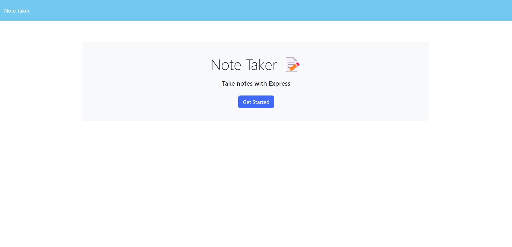
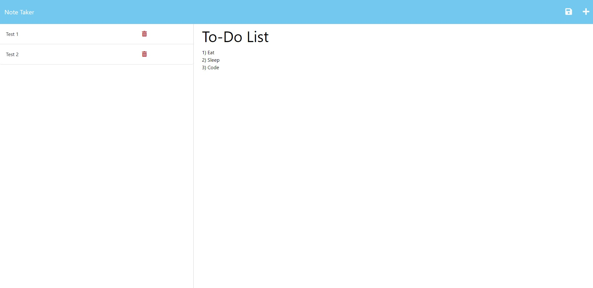

# note-taker

## Description

This is a note-taking application, built with node/express. The app will allow the user to create, save, and delete notes for general purpose. 

## Table of Contents

* [Usage](#Usage)
* [Screenshots](#Screenshots)
* [Contributors](#Contributors)
* [License](#License)
* [Contact](#Contact)

## Usage

You can find the deployed app here: https://ds-note-taker.herokuapp.com/ds-note-taker   

- Once on the homepage, click the "Get Started" button. 
- On the next screen, you'll see a list of saved notes on the left, and a note-taking area on the right. 
- When you create a new note, you can save it by clicking the floppy-disk save icon on the top right of the screen. 
- To delete a note, simply click on the little red trash can icon next to the note you want to delete.

## Screenshots

## Contributors

- Starter code provided by GT Coding Bootcamp.
- Express server routes written by [github/dereksutton](https://github.com/dereksutton)
- Another resource that helped me to better grasp Node/Express.js for this project ==> [Extra Resource](https://www.udemy.com/course/just-express-with-a-bunch-of-node-and-http-in-detail/)

## License

[MIT](https://opensource.org/licenses/MIT)

## Contact

Built by [github/dereksutton](https://github.com/dereksutton). You can email me [here](mailto:dereksutton86@gmail.com).
